# Dokumentasi Tugas Database Perpustakaan

## 📸 Hasil Query & Database

### 🔹 Statistik Buku
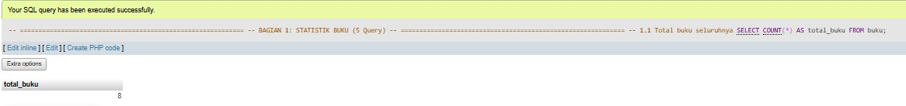
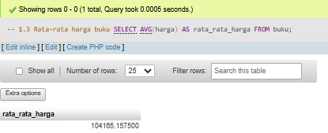
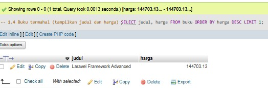
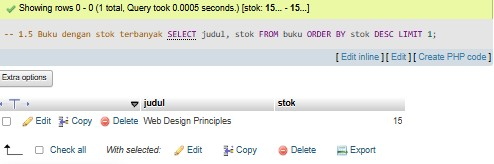

---

### 🔹 Filter & Pencarian
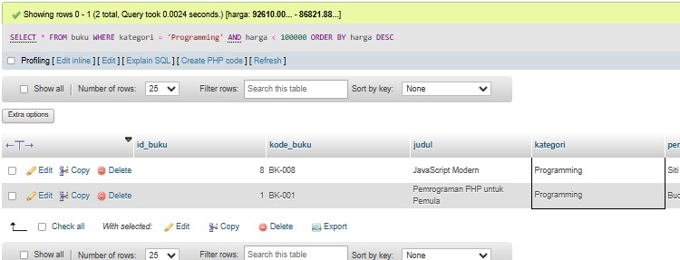
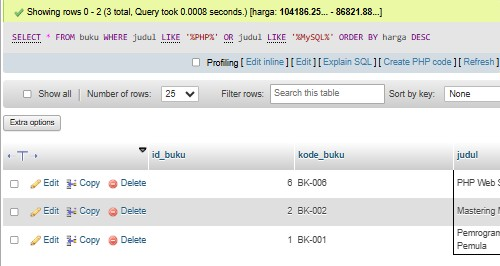
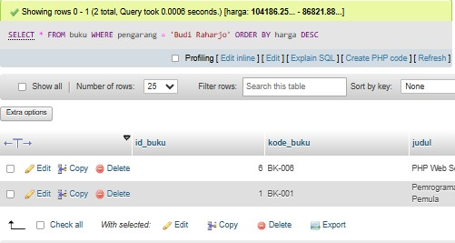
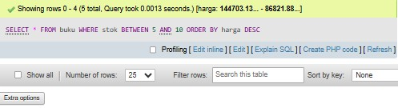

---

### 🔹 Database & Tabel
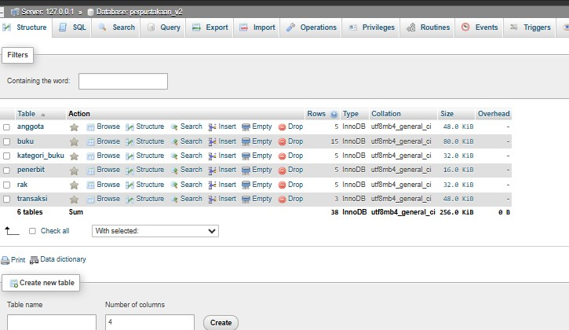
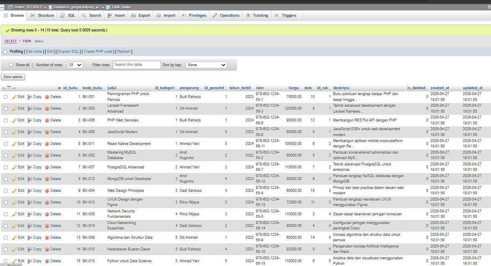
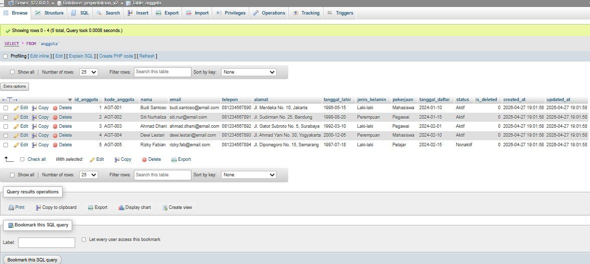

---

### 🔹 Query JOIN
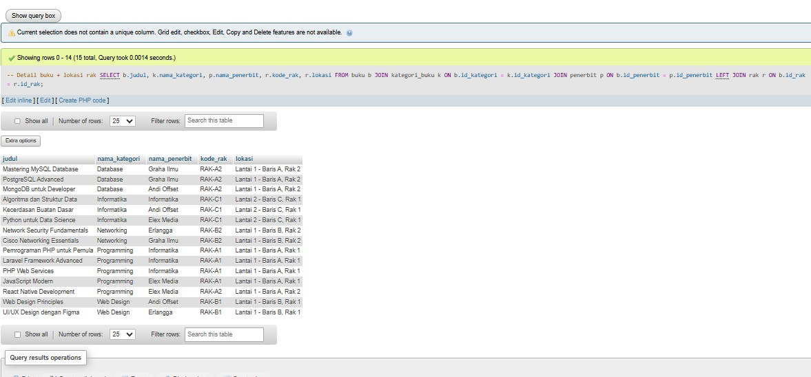

---

### 🔹 ERD
.pdf)
